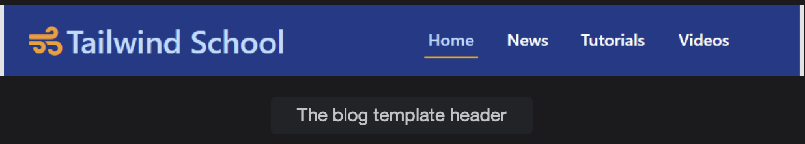

# Building a Blog Starter Template

Learn how to build a blog starter template.

> We'll cover the following:
>
> - Sample application
> - Creating the header

In this lesson, we'll explore how to build a simple blog starter template from scratch. We won't go too deeply into the details of each individual utility class, but enough explanation will be provided.

> **NOTE:** As we dive into building our starter template with Tailwind, it's important to note that Tailwind applies an opinionated set of base styles for every project by default.

# Sample application

## Creating the header

We'll build the template from top to bottom, starting with a header.  
 The following image shows what we're trying to create.

To create the header, [see here](./blog-template.html)

Code is broken into smaller blocks.  
 First, we've wrapped all the content in a container by adding the container class in the wrapping div element.
